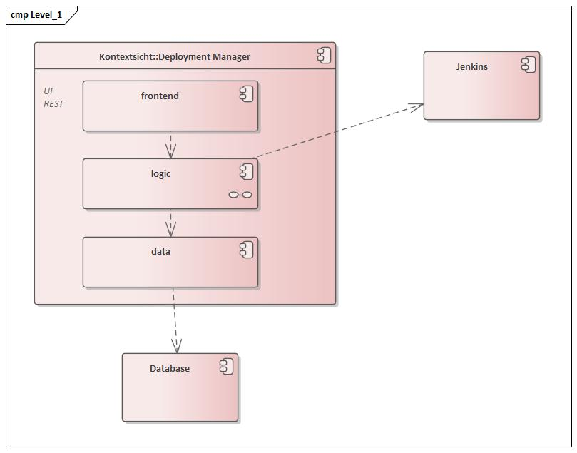
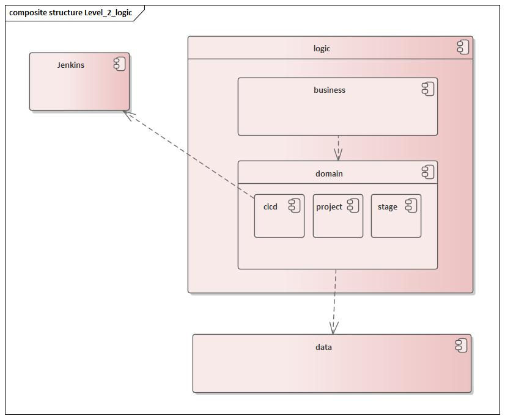

[[section-building-block-view]]
== Bausteinsicht

=== Whitebox Gesamtsystem

= 

Begründung:: _<Erläuternder Text>_

Enthaltene Bausteine:: _<Beschreibung der enthaltenen Bausteine (Blackboxen)>_

Wichtige Schnittstellen:: _<Beschreibung wichtiger Schnittstellen>_

==== <Name Blackbox 1>

_<Zweck/Verantwortung>_

_<Schnittstelle(n)>_

_<(Optional) Qualitäts-/Leistungsmerkmale>_

_<(Optional) Ablageort/Datei(en)>_

_<(Optional) Erfüllte Anforderungen>_

_<(optional) Offene Punkte/Probleme/Risiken>_

==== <Name Blackbox 2>

_<Blackbox-Template>_

==== <Name Blackbox n>

_<Blackbox-Template>_

==== <Name Schnittstelle 1>

...

==== <Name Schnittstelle m>

=== Ebene 2

==== Whitebox _<Baustein logic>_

= 

_<Whitebox-Template>_

==== Whitebox _<Baustein 2>_

_<Whitebox-Template>_

...

==== Whitebox _<Baustein m>_

_<Whitebox-Template>_

=== Ebene 3

==== Whitebox <_Baustein x.1_>

_<Whitebox-Template>_

==== Whitebox <_Baustein x.2_>

_<Whitebox-Template>_

==== Whitebox <_Baustein y.1_>

_<Whitebox-Template>_
