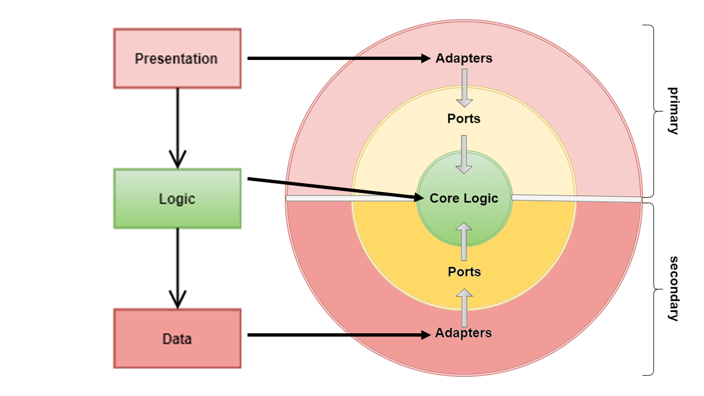

[[section-concepts]]
== Querschnittliche Konzepte

=== _Domain Driven Design_

Die Anwendung ist anhand des DDD-Ansatzes aufgebaut. Die wesentliche Struktur dafür findet sich im _Logic_-Package der
Anwendung <<05_building_block_view.adoc#Bausteinsicht>>. Die übergeordnete Geschäftslogik der Anwendung findet sich im
Package _business_.

= 

==== Geschäftslogik
Die Geschäftsprozesse werden dabei als Interfaces mit Ending _Flow_ im Interfacenamen sowie in der
Klassenimplementierung gekennzeichnet.

*Bemerkung*

Im Gegensatz zu anderen DDD-Verfahren wird die Geschäftslogik nicht im _Aggregate Root_ bzw. in _Value Objects_ untergebracht.
Der Flow ist so implentiert, dass er entsprechend des Prinzips der _Single Responsibility_ nur die Services verwendet, die für
den entsprechenden _Ablauf (Flow)_ relevant sind.

Flows werden in _ViewScoped_ Beans eingebunden, die ein Interface (Port, s. Grafik oben) zur Kernlogik darstellen.

====
*Beispiel 1*

[source, java]
----

//Interface
public interface BuildFlow {
    /**
     * Führt den Buildjob eines Projects aus
     * @param ProjectId
     */
    void build(Long ProjectId);
}

//Implementierung
public class BuildFlowImpl implements BuildFlow {

    private final CiCdService ciCdService;∂
    private final ProjectService projectService;

    @Inject
    public BuildFlowImpl(CiCdService ciCdService, ProjectService projectService) {
        this.ciCdService = ciCdService;
        this.projectService = projectService;
    }

    @Override
    public void build(Long projectId) {
        Project project = projectService.getProject(projectId);
        ciCdService.buildImage(project.getBuildJob());
    }
}
----
====

====
*Beispiel 2*

Verwendung in _ViewScopedBean_
[source, java]
----

@ViewScoped
@Named
public class PipelineFormBean implements Serializable {

    @Getter
    private List<Image> images;
    @Getter
    private Project project;
    @Getter
    private List<ProjectStageModel> appsDeployed;

    @Inject
    private LoadPipelineFlow loadProjectFlow;

    @Inject
    private DeployFlow deployFlow;

    @Inject
    private BuildFlow buildFlow;
    ...

    public void build() {
        buildFlow.build(project.getId());
    }
}

----
====

Aus den obigen Beispiel wird klar und ist einfach lesbar, dass ein Build im Jenkins über die View für die Pipeline gestartet werden kann. Der _BuildFlow_ macht durch den
übergebenen Paraemter einer ProjektId deutlich, dass der Build für ein gesamtes Projekt angestoßen wird.

Das wird direkt durch das UI klar, wobei das Projekt _Deployment Manager_ heißt:

= image:../images/build_pipeline.png[UI]

=== _<Konzept 2>_

_<Erklärung>_

...

=== _<Konzept n>_

_<Erklärung>_
